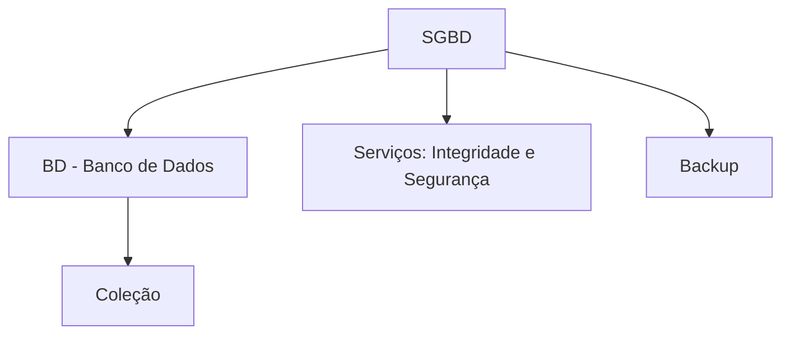
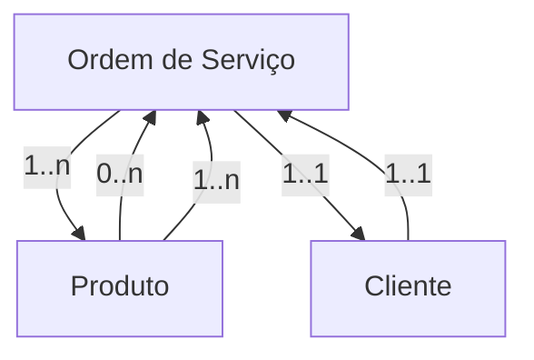
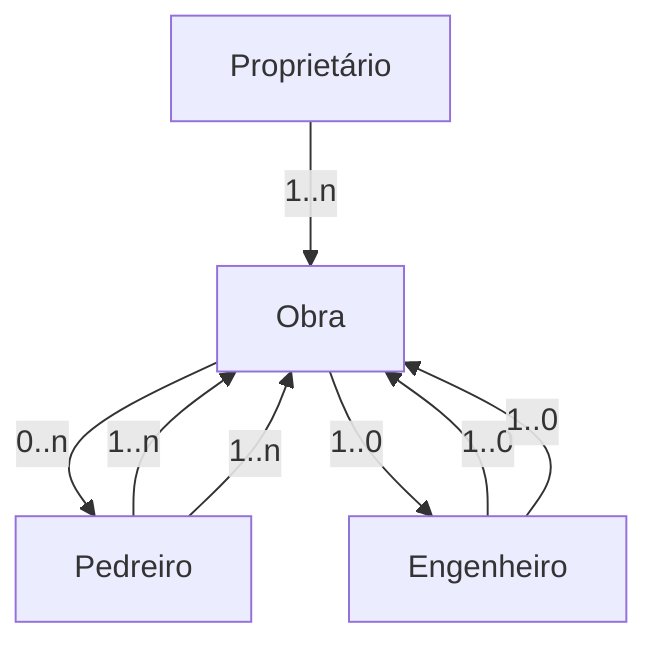

```plaintext
      +----------------------+
      |       SGBD          |
      |  +--------------+   |
      |  |     BD       |   |
      |  |  "coleção"   |   |
      |  +--------------+   |
      | Serviços:           |
      | - Integridade       |
      | - Segurança         |
      |                      |
      | BACKUP               |
      +----------------------+
```



---

# SaaS

## Estrutura
### **Modelo Ordem de Serviço (OS)**
#### **Texto ASCII**
```plaintext
              +----------------+
              |      O.S.      |
              | -------------- |
              | *Número OS*    |1..n
              | *Descrição*    |---------------------+                    
              +----------------+                     |
                      | 0..n                         |
                      |                              |
                      v 1..n                         |
              +----------------+                     |
              |    Produto     |                     |
              | -------------- |                     |
              | Código Produto |                     |
              | Descrição      |                     |
              | Marca          |                     |
              | Modelo         |                     |
              +----------------+                     |
                                                     |
              +----------------+---------------------|
              |    Cliente     |1..1
              | -------------- |
              | *CPF* (PK)     |
              | Nome           |
              +----------------+
                      ^
                      |
                      |
              Atributos ou Variáveis 
              ou Propriedades Federais
```

#### **Diagrama Mermaid.js**


### Descrição : 3 tabelas, (cliente)|(produto)|(ordem e serviço)

---

## Conceitos Gerais

- **Entidades** (*Modelo ER*)
- **Classes** (*Modelo OO*)
- **Categoria**

---

## Estatística

                O
               /|\
              / | \
             O--O--O  → **Tendência geral**
               |
               O
               
               ↓
        **Tendência de um**

---

## Mineração de Dados

        (  )  → **Mineração**


---

### **Banco de Dados**
- Compartilhamento de dados 
- Sistema de gerenciamento de banco de dados

### **Modelos de Banco de Dados**
- Modelo conceitual
- Modelo lógico
- Modelo conceitual como modelo de organização

### **Projeto de Banco de Dados**
**Modelar → Conceitual → Lógico → Físico ⇒ Projetar**

---

## **Como a informática é adotada em organizações**
- A informática é implementada gradativamente.
- Exemplo: empresa hipotética.
- Implementação gradual de sistemas para:
  - Vendas
  - Produção
  - Compras
- **Onde ficam os dados do produto?**

---

### **Sistema de Gerenciamento de Banco de Dados**
- Início da programação de aplicações.
- Os primeiros programas continham todas as operações:
  - Interface do usuário.
  - Transformação de dados e cálculos.
  - Operações de armazenamento de dados.
  - Comunicação com outros sistemas e programas.

---

### **Modelo de dados - Conteúdo**
- Exemplo de industria
- Modelo de dados informa
    - são armazenados informações sobre o produto
    - para cada produto, são armazenados seu codigo. preço

## **Na computação, o que significa modelar e projetar um sistema ou um banco de dados?**
Na computação, **modelar** e **projetar** um sistema ou um banco de dados são etapas fundamentais no desenvolvimento de software. Cada um desses termos tem um significado específico e está relacionado à forma como os sistemas são estruturados, organizados e implementados.

---

## **1. Modelar um Sistema ou Banco de Dados**
Modelar significa criar uma **representação abstrata** do sistema ou banco de dados antes de implementá-lo. Essa modelagem permite entender, planejar e visualizar a estrutura e o comportamento do sistema.

### **Modelagem de Sistemas**
A modelagem de sistemas envolve a criação de diagramas e representações conceituais para descrever a funcionalidade e a estrutura de um sistema de software. Algumas abordagens comuns incluem:

- **Diagramas UML (Unified Modeling Language)**:
  - **Diagrama de Casos de Uso** (quem interage com o sistema e quais funcionalidades são oferecidas).
  - **Diagrama de Classes** (estrutura dos objetos e suas relações).
  - **Diagrama de Sequência** (fluxo de interações entre os componentes do sistema).
  - **Diagrama de Estado** (estados possíveis de um componente do sistema).

- **Modelagem de Processos de Negócio**:
  - Utiliza **BPMN (Business Process Model and Notation)** para representar fluxos de atividades dentro da empresa.

### **Modelagem de Banco de Dados**
Na modelagem de banco de dados, criamos representações visuais da estrutura de armazenamento de dados. As etapas mais comuns são:

1. **Modelo Conceitual**:
   - Representa a estrutura de dados **de forma abstrata**.
   - Usa diagramas **Entidade-Relacionamento (ER)**.
   - Define **entidades, atributos e relacionamentos**.

2. **Modelo Lógico**:
   - Traduz o modelo conceitual para um **modelo relacional** (ou outro tipo de modelo de banco de dados).
   - Define **tabelas, colunas, chaves primárias e estrangeiras**.

3. **Modelo Físico**:
   - Representa como os dados serão **armazenados fisicamente** no SGBD (Sistema Gerenciador de Banco de Dados).
   - Define **índices, tipos de dados, partições, otimizações de desempenho**.

---

## **2. Projetar um Sistema ou Banco de Dados**
Projetar um sistema significa definir a **arquitetura, as tecnologias e a estrutura detalhada** do sistema antes da implementação.

### **Projeto de Sistemas**
O projeto de um sistema envolve:
- Escolher a **arquitetura** (Monolítica, Microservices, Cliente-Servidor).
- Definir as **tecnologias** (linguagens de programação, frameworks, bancos de dados, APIs).
- Projetar a **arquitetura de software** (MVC, Clean Architecture, Camadas, etc.).
- Estabelecer padrões de segurança, desempenho e escalabilidade.

### **Projeto de Banco de Dados**
O projeto de banco de dados envolve:
- Definir **estratégias de indexação e otimização**.
- Planejar **backup e recuperação** de dados.
- Escolher o **SGBD mais adequado** (MySQL, PostgreSQL, MongoDB, etc.).
- Implementar regras de **integridade e segurança**.

---

## **Resumindo**
| **Termo**   | **Significado** |
|-------------|----------------|
| **Modelar** | Criar representações **abstratas** do sistema ou banco de dados para planejar sua estrutura e funcionamento. |
| **Projetar** | Definir a **arquitetura, tecnologias e implementação** do sistema ou banco de dados, garantindo eficiência e segurança. |

Modelagem é **a fase inicial**, enquanto o projeto detalha como será a **implementação real** do sistema ou banco de dados.

---

### **Questões Fundamentais**
- **O que** → Modelar
- **Como** → Projetar (definir metodologia)
- **Por quê** → Justificar a necessidade do sistema

obra pedreiro engenheiro

# Modelo de Relacionamento


### **Modelo de Obras (Proprietário, Obra, Pedreiro, Engenheiro)**
#### **Texto ASCII**
```plaintext
                +------------------+
                |   Proprietário   |
                | ---------------- |
                | *CPF*            |
                | Nome             |
                | Endereço         |
                +------------------+
                        |
                        |
                        | 1..n
                        |
                        v
                +------------------+ 0..n
                |       Obra       |-------------------------
                +------------------+                        |   
                        |                                   |
                        | 0..n                              |
                        |                                   |
                        v 1..n                              |
                +------------------+        1..0            |
                |    Pedreiro      |-------------------+    |   
                | ---------------- |                   |    |
                | *CPF*            |                   |    |
                | Especialidade    |                   |    |
                | Endereço         |                   |    |
                +------------------+                   |    |
                                                       |    |
                                                       |    |
                                                       |    |
                                                       |    |
                +------------------+                   |    |
                |    Engenheiro     | <----------------+    |
                | ---------------- |                        |
                | *CPF*, CNPJ      |------------------------+
                | Nome             |
                | CREA             |
                | Endereço         |
                +------------------+
```

#### **Diagrama Mermaid.js**

